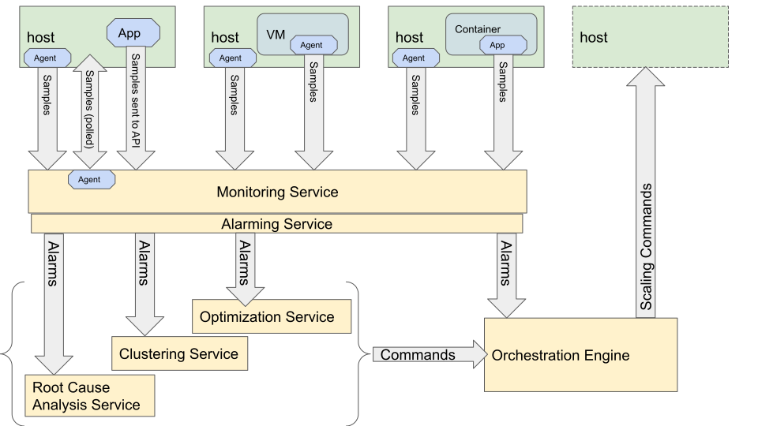

======================
Theory of Auto-Scaling
======================

.. contents::
   :depth: 2
   :local:

General Description
===================

In OpenStack, "Auto-Scaling" refers to the ability of a Cloud to automatically
detect conditions related to load in the Cloud and to react appropriately without
an Operator's intervention.

This generally refers to Compute workloads in the Cloud, but the SIG also
discusses use cases around scaling for the Control Plane or other resources.

Auto-Scaling includes both scale-up and scale-down actions to try to appropriately
and efficiently allocate resources and avoid problems.  This aims for the best
Customer experience and return on investment.

Auto-Scaling uses many of the same services and technologies as used in `Self Healing`_.

Where Self Healing is focused on healing a Cloud when a failure occurs, Auto-Scaling
is concerned with avoiding issues by allocating more resources when a need is detected
or predicted, or in conserving resources by deactivating them when loads are low.

Mission
-------
This SIG aims to improve the experience of developing, operating, and using auto-scaling and its related features
(like metering, cluster schedule, life cycle management), and to coordinate efforts across projects and communities
(like k8s cluster auto-scaling on OpenStack). The SIG also provides a central place to put tests, documentations,
and even common libraries for auto-scaling features.

The SIG is expected to focus more on auto-scaling user workloads; however work on auto-scaling infrastructure is
also welcome, especially considering that user workloads in an undercloud are actually infrastructure in the
corresponding overcloud.

Background
----------
OpenStack provides multiple methods to auto-scale your cluster (Like using Heat AutoScalingGroup,
Senlin Cluster, etc.). However without general coordination across projects, it may not be easy for users and ops
to achieve auto-scaling on OpenStack. Developers tend to be focused on individual projects rather than cross-project
integration. Most of the components required by auto-scaling already exist within OpenStack, but we need to provide
a more simple way for users and ops to adopt auto-scaling. And allowing developers to coordinate together instead of
implement something all over again.

Conceptual Diagram
==================

         and Alarming, Decision Services, and Orchestration Engine

Components of Auto-Scaling
==========================

OpenStack offers a rich set of services to build, manage, orchestrate, and
provision a cloud. This gives administrators some choices in how to best serve
their customer's needs.

* Scaling Units - There are a number of components that can be controlled
  with Auto-Scaling.

  * Compute Host
  * VM running on a Compute Host
  * Container running on a Compute Host
  * Network Attached Storage
  * Virtual Network Functions

* Monitoring Service - Monitoring works by either using an agent installed on
  the Scaling Unit, or using a polling method to retrieve metrics.

  * `Monasca`_
  * Ceilometer from the `Telemetry`_ project
  * Prometheus

* Alarming Service

  * `Monasca`_ has a built in alarm thresholding service and notification service
  * Aodh from the `Telemetry`_ project

* Decision Services - There are a number of services in OpenStack that can
  interpret metrics and alarms based on configured logic and produce commands
  to Orchestration Engines.

  * `Congress`_
  * `Heat`_ can contain logic for auto-scaling decisions in HOT templates
  * `Mistral`_
  * `Vitrage`_
  * `Watcher`_

* Orchestration Engines

  * `Heat`_
  * `Senlin`_ is a clustering engine for OpenStack, and can orchestrate auto-scaling
  * `Tacker`_

Considerations and Guidelines
=============================

* Monitoring takes resources, plan accordingly

  * The more metrics monitored, the greater the bandwidth usage and CPU to process.
    The longer the retention period for metrics, the more storage needed.

* Avoid scaling too quickly or too often

  * This can be done by specifying appropriate cooldown periods.
  * Another technique is to average the scaling metric over a longer time period to avoid reacting to sudden
    fluctuations.

* Don't expect instantaneous scaling (see above)

  * Define thresholds to be predictive of scale needs, not reactive to a bad state

* Be aware of where the logic for scaling is (alarm thresholds, decision services)

* Define appropriate scaling limits in terms of minimum and maximum instances.

  * Minimum number of instances will prevent all the instances from being removed.
  * Maximum number of instances safeguards against provisioning too many resources that could adversely affect
    other workloads.

* Applications must be horizontally scalable in order to auto-scale the underlying instances.

  * Applications must be stateless or be able to drain existing stateful connections so that the underlying
    instances can be removed during a scale down.
  * Incoming requests must be dynamically load balanced among the instances running the application.

Anecdotes and Stories
---------------------

There are many experiences which can be captured and shared around auto-scaling.
Please also refer to the Use Cases.

.. _Congress: https://wiki.openstack.org/wiki/Congress
.. _Heat: https://wiki.openstack.org/wiki/Heat
.. _Mistral: https://docs.openstack.org/mistral/latest/
.. _Monasca: https://wiki.openstack.org/wiki/Monasca
.. _Self Healing: https://docs.openstack.org/self-healing-sig/latest/
.. _Senlin: https://docs.openstack.org/senlin/latest/scenarios/autoscaling_heat.html
.. _Telemetry: https://wiki.openstack.org/wiki/Telemetry
.. _Tacker: https://wiki.openstack.org/wiki/Tacker
.. _Vitrage: https://wiki.openstack.org/wiki/Vitrage
.. _Watcher: https://wiki.openstack.org/wiki/Watcher